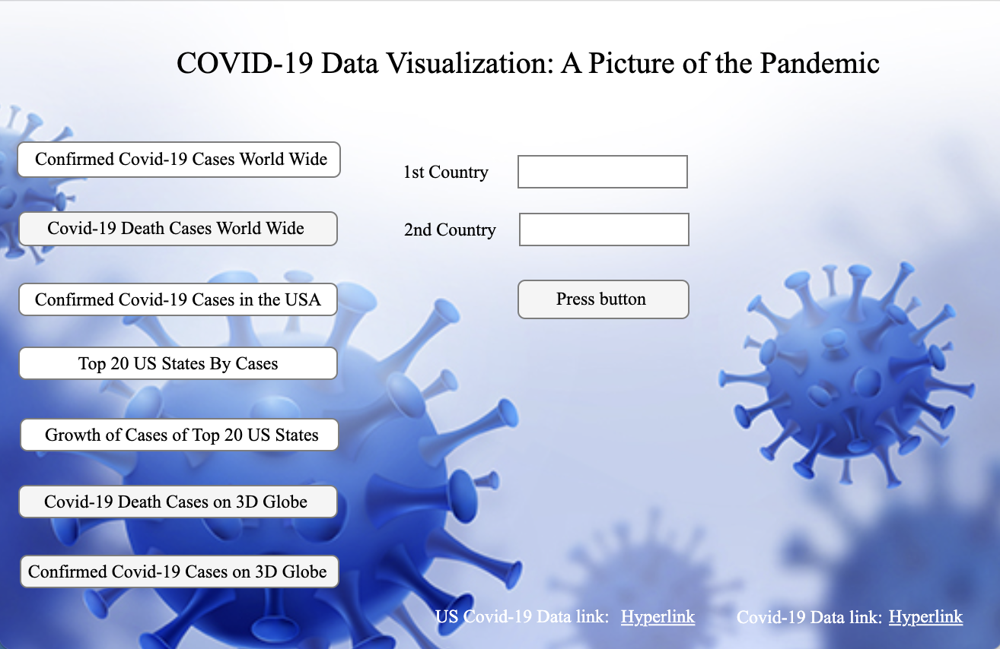

# COVID-19 Data Visualization: A Picture of the Pandemic

## Overview

This project provides a comprehensive MATLAB-based application for visualizing and analyzing COVID-19 data from around the world. It offers various visualization techniques including geographic bubble charts, time-series plots, interactive 3D globe visualizations, and comparative analyses across countries and US states.

## Features

- **Global COVID-19 Case Visualization**: Interactive geobubble maps showing the spread of confirmed cases worldwide
- **Death Cases Visualization**: Geographic visualization of COVID-19 mortality data
- **US States Analysis**: Detailed breakdown of cases by US states with ranking and growth visualization
- **Country Comparison Tool**: Compare COVID-19 growth curves between any two countries
- **3D Interactive Globe**: Novel 3D visualization of global COVID-19 data plotted on an interactive Earth model
- **Time Series Analysis**: Track the progression of cases and deaths over time since 2020
- **User-Friendly Interface**: MATLAB app with buttons and interactive elements for easy data exploration

## Technologies

- **MATLAB R2022b**
- **MATLAB App Designer** for creating the graphical user interface
- **Mapping Toolbox** for geographic visualizations
- Data cleaning and transformation techniques
- Time series analysis methods
- Geospatial data visualization

## Installation and Usage

### Prerequisites
- MATLAB R2022b or later
- MATLAB Mapping Toolbox

### Setup
1. Clone this repository
2. Download the required datasets (see Data Sources section below)
3. Place the dataset files in the `data/` directory
4. Run `start.m` to launch the application

### Data Sources
The application uses data from:
- [Johns Hopkins CSSE COVID-19 Data Repository](https://github.com/CSSEGISandData/COVID-19/tree/master/csse_covid_19_data/csse_covid_19_time_series)
- [New York Times COVID-19 Data](https://github.com/nytimes/covid-19-data)

Download the following files from these repositories:
- `time_series_covid19_confirmed_global.csv`
- `time_series_covid19_confirmed_US.csv`
- `time_series_covid19_deaths_global.csv`
- `us-states.csv`

## Screenshots and Visualizations

### World Map of COVID-19 Cases

### US States Ranking

### Country Comparison

### 3D Globe Visualization

## Application Usage Guide

### Country Comparison
1. From the main interface, select the "Country Comparison" button
2. Enter the name of the first country in the input box
3. Enter the name of the second country for comparison
4. Click "Plot" to visualize the comparison

**Note**: Refer to the `Countries.pdf` file for the exact country names used in the dataset.

### US States Analysis
1. Click on the "US States Ranking" button to see the top 20 states by case count
2. Use the "US States Growth" button to visualize the growth patterns across the top states

### 3D Globe Visualization
1. Select either "3D COVID-19 Cases" or "3D COVID-19 Deaths" to launch the interactive globe
2. Use your mouse to rotate and explore the visualization
3. Marker sizes indicate the relative magnitude of cases or deaths

## Project Structure

- `start.m`: Entry point script to launch the application
- `Covid_Case_Analysis.mlapp`: MATLAB app for the user interface
- `Final_Project.m`: Main analysis script with data processing and visualization code
- `CovidDataFor3DPlots.csv`: Preprocessed data for the 3D globe visualizations
- `Countries.pdf`: Reference for country names in the dataset

## Implementation Highlights

This project demonstrates several important data analysis and visualization techniques:

1. **Data Cleaning and Preprocessing**: Handling inconsistent country names, missing values, and data normalization
2. **Geographic Visualization**: Using MATLAB's geobubble and geoglobe functions for spatial data representation
3. **Time Series Analysis**: Processing and visualizing temporal patterns in pandemic data
4. **Interactive User Interface**: Creating a functional app for data exploration
5. **3D Data Visualization**: Innovative approach to representing global data on a 3D model

## Author

- Fadel Batal

## License

This project is licensed under the MIT License - see the LICENSE file for details.

## Acknowledgments

- Johns Hopkins University CSSE for COVID-19 data
- The New York Times for US-specific COVID-19 data
- MATLAB documentation and community for visualization techniques
